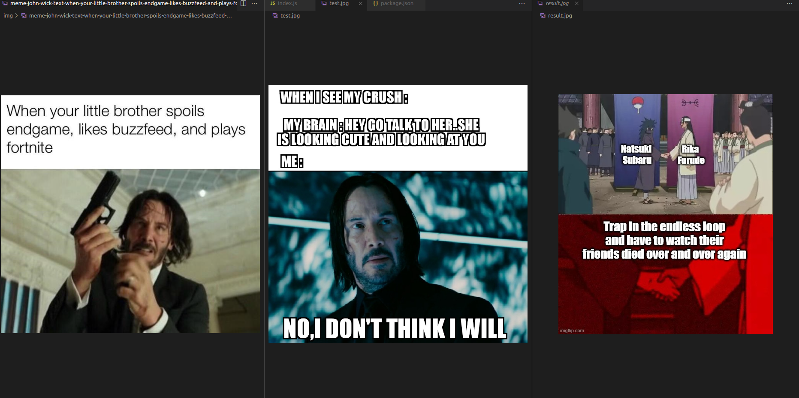

# Image-Search-Engine-using-Weavier-and-ResNet50

This code is inspired from Fireship YouTube Channel.

# Instructions to run:

```
npm install
docker-compose up -d
```

# Inferences

Check out the images in the inferences.

There are 3 images in a inference - train, test and result (from left to right). 


